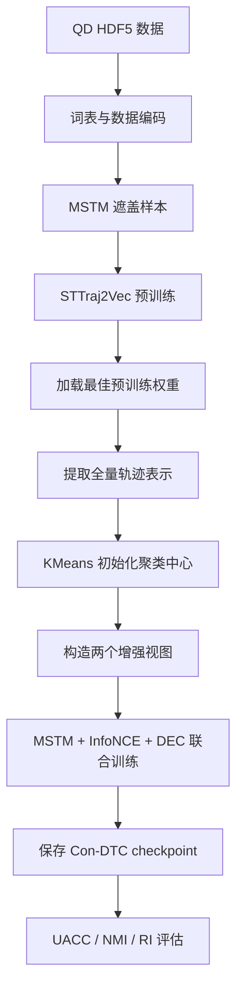

实现参考：
- Con-DTC 论文
- 作者开源源码：https://github.com/TrajResearch/ConDTC

## 执行流程

## 预训练

预训练阶段采用 Masked Spatial-Temporal Modeling：

1. 随机选择轨迹点；
2. 同时遮盖对应的位置 token 和时间 token；
3. 使用 Transformer 编码轨迹；
4. 分别预测原始位置和时间；
5. 保存验证集损失最小的模型。

## 微调阶段
1. 加载预训练权重；
2. 提取全量原始轨迹表示；
3. KMeans 初始化 DEC 中心；
4. 每个 epoch 更新全局 \(Q\) 和 \(P\)；
5. 构造点丢弃和时间偏移视图；
6. 计算联合损失；
7. 更新编码器、投影头和聚类中心。