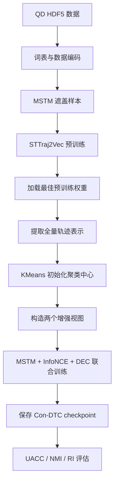

实现参考：
- Con-DTC 论文
- 作者开源源码：https://github.com/TrajResearch/ConDTC

固定原始输入的逐轮表示与簇分配诊断，参见 [baseline 表示稳定性实验](configs/baseline_representation_stability/README.md)。

## DART-C 与 LFSS 表示约束

可选顶层 `lfss` 配置启用表示分支：`noise_weight` 控制跨视图 EMA 自蒸馏 LS，
`instance_weight` 控制同视图前代实例对比 LI。两者均从第 1 轮启用；
目标编码器与投影头在每次优化器更新后做 EMA，前代网络在轮初复制上一轮末的 EMA 目标，轮内冻结。
在线投影加高斯噪声后经过预测头计算 LS；LI 沿用已实验版本的仅负样本分母，允许为负。
此分支不使用簇标签、不进行样本排除或额外 K-means，不接入 LC。

两种表示损失均作用于全部批次样本；DART 的插值与反向加权仍只作用于聚类目标及 DEC 损失。
目标网络不通过反向传播更新，辅助损失没有对 DEC 中心的直接梯度。
编码器同时接收原有损失和表示辅助损失的梯度，联合裁剪后更新。
推理仍只需在线 ConDTC 模型，其 `model_state_dict` 结构不变。

示例配置：

- [Porto pre15：DART-C + LS + LI](configs/baseline_representation_stability/condtc_porto_dart_full_lfss_pre15.yaml)
- [QD pre15：DART-C + LS + LI](configs/baseline_representation_stability/condtc_qd_dart_full_lfss_pre15.yaml)

```bash
cd con-dtc
python -m src.experiment.run --config configs/baseline_representation_stability/condtc_qd_dart_full_lfss_pre15.yaml
```

示例沿用 `LS=1.0, LI=0.1, target_momentum=0.996, temperature=0.5, noise_std=0.001`，
DART 分配 EMA 则保持 `start_epoch=3, momentum=0.7`。设其中一个损失权重为 0 可做单项消融。
不提供 `lfss` 或设 `enabled: false` 时不创建辅助网络；开启时必须把旧版
`loss.history_instance_loss_weight` 设为 0，避免重复叠加两套历史对比。

开启 `training.save_representation_history` 后，原有 `embeddings/q/cluster_centers` 继续保存。
启用 LFSS 时快照使用 schema 3，额外保存 `projected_embeddings`、`projection_norms`、
`projection_cosine_previous` 和有效掩码；`summary.json` 同时给出 z 与 h 的跨轮余弦统计。
投影头使用 eval 模式进行诊断，原始输入、随机状态及模型/投影头模式均保持不变；标签仅供离线分析。

日志分别记录 `lfss_ls`、`lfss_li`、加权合计 `lfss_loss` 与原有 `base_loss`。
checkpoint 单独保存 `lfss_state_dict`（含 EMA、前代、两个头、轮次及独立噪声状态）。
同时保存 `condtc_best.pt` 与 `condtc_last.pt`：旧配置默认仍选基础损失最小的 best，
新示例用 `training.checkpoint_selection: last` 评估固定 6 轮后的模型。
对比实验需统一这一选择规则；逐轮诊断快照始终对应实际轮末模型。

## 执行流程


## 预训练

预训练阶段采用 Masked Spatial-Temporal Modeling：

1. 随机选择轨迹点；
2. 同时遮盖对应的位置 token 和时间 token；
3. 使用 Transformer 编码轨迹；
4. 分别预测原始位置和时间；
5. 保存验证集损失最小的模型。


## 微调阶段
1. 加载预训练权重；
2. 提取全量原始轨迹表示；
3. KMeans 初始化 DEC 中心；
4. 每个 epoch 更新全局 \(Q\) 和 \(P\)；
5. 构造点丢弃和时间偏移视图；
6. 计算联合损失；
7. 更新编码器、投影头和聚类中心。
